# SOLUCION DEL LABORATORIO 

## ESTUDIANTES:
1. Roger Mauricio Duran Guacaneme
2. Camilo Alfonso Leon Acosta


## PREPARACION DEL ENTORNO:

Relazamos la instalación de dependencias y configuración del proyecto con Vite, React, Redux Toolkit, Axios y Vitest. Se creó el archivo `.env` para definir la URL base del backend y se configuró el servicio de Blueprints para alternar entre el mock y el cliente real según la variable `VITE_USE_MOCK`.

Al realizar el `npm test`, se verificó que las pruebas unitarias iniciales pasaran correctamente, al no pasar esto lo que se realizó fue que en el archivo `vitest.config.js` se configuró el `globals: true`.

El tercer cambio realizado fue en el archivo `src/components/BlueprintCanvas.jsx` en donde se agrego un guard `if (!ctx) return` despues de obtener el contexto del canvas.
```
//Antes
const ctx = canvas.getContext('2d')
ctx.clearRect(0, 0, canvas.width, canvas.height) 

//Después
const ctx = canvas.getContext('2d') 
if (!ctx) return
ctx.clearRect(0, 0, canvas.width, canvas.height)
```
En los tests, Vitest usa jsdom como entorno de navegador falso. jsdom no implementa el Canvas real (necesitaría el paquete canvas de npm). El archivo setup.js intenta poner un mock de getContext, pero el test de BlueprintCanvas.test.jsx hace esto:
```const spy = vi.spyOn(HTMLCanvasElement.prototype, 'getContext')```
Ese spyOn reemplaza el mock del setup con un spy que llama al original de jsdom → jsdom retorna null. Entonces ctx era null y la línea ctx.clearRect(...) lanzaba TypeError: Cannot read properties of null.
Con el `if (!ctx) return`, el componente simplemente no dibuja nada en tests (lo cual está bien), y no explota.

Y el ultimo cambio que se realizo fue agregar los cambios en atributos `htmlFor` a los `<label>` e `id` en los `<inputs>` y `<textarea>`.
```
//Antes
<label>Author</label>
<input className="input" value={author}... />

//Después
<label htmlFor="bp-author">Author</label>
<input id="bp-author" className="input" value={author}... />
``` 

Pasa lo mismo para "Nombre" (`bp-name`) y "Puntos (JSON)" (`bp-points`). Esto debido a que los tests hacian esto:

```
fireEvent.change(screen.getByLabelText(/Autor/i), { target: { value: 'john' } }) 
```

`getByLabelText` busca un campo de formulario asociado a un label con ese texto. En HTML, la asociacion entre un <label> y su input se hace mediante:
- `<label htmlFor="X">` apuntando a `<input id="X">`

Ya que sin estos atributos, testing library encuentra el label con texto "Author" pero no encuentra ningun input conectado a el; de esta manera, lanza el error `"no form control was found associated to that label"`; este cambio ademas mejora la accesibilidad del formulario.


## IMPLEMENTACION DE APIMOCK Y APICLIENT:

En este encabezado nos encargamos de la implementacion de los servicios de 'apimock.js' y 'apiclientservice.js' los cuales implementan la misma interfaz, esto para poder alternar entre el mock y el cliente real segun la variable 'VITE_USE_MOCK' en el archivo '.env'.

Ahora, lo que se realizo en este encabezado fue la implementacion de los metodos de la interfaz, los cuales son: `getAll`, `getByAuthor`, `getByAuthorAndName` y `create`; entonces de este modo quedaron asi las siguientes clases.

`apimock.js`:
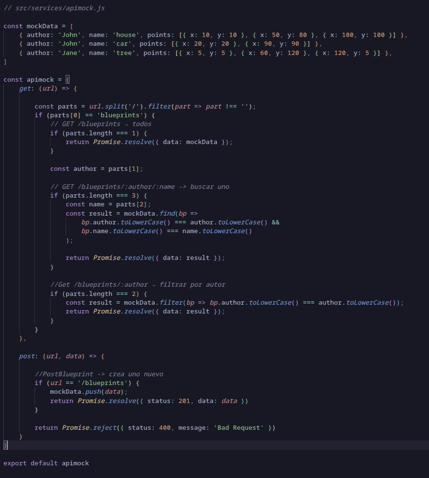

`apiclientservice.js`:
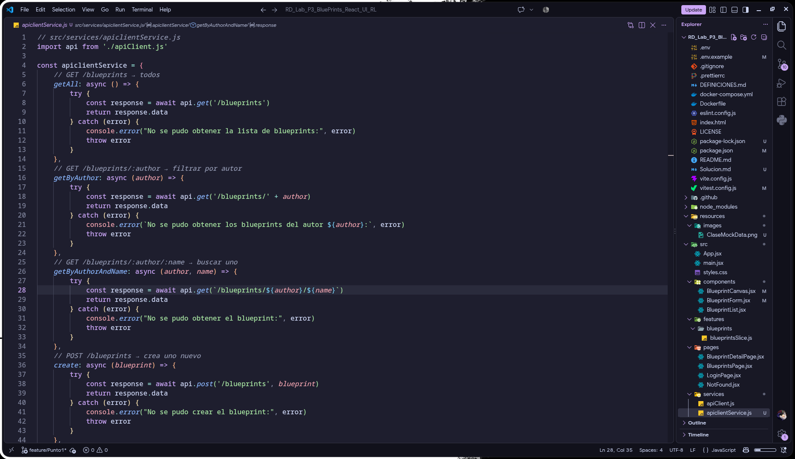

En estas clases podemos evidenciar que se implementaron los metodos de la interfaz, y en el caso de `apimock.js` se implemento un arreglo de objetos de prueba para poder retornar datos desde memoria, mientras que en `apiclientservice.js` se implemento el consumo del API REST real con Axios, junto a esto si implemento una forma de llamar los datos desde los diferentes endpoints del backend sin necesidad de tener que escribir la url completa, esto gracias a tener presente los principios SOLID, en escaso el principio de responsabilidad unica y open/close, ya que cada que nos envien la query con un usuario y sector en especifico lo que vamos a realizar es diseccionar esto para llamar el valor al endpoint correspondiente, de esta manera se puede tener un codigo mas limpio y organizado.

La forma en la que haremos esto es diseccionar la url que nos envien, `const parts = url.split('/').filter(part => part !== '');` esto nos va a permitir realizar una busqueda de los diferentes elementos que componen la url, para luego poder obtener el autor y el nombre del plano, de esta manera podemos llamar al endpoint correspondiente.

## CREACION DEL MODULO BLUEPRINTS SERVICE:

En este encabezado nos encargaremos de la creacion del modulo `blueprintsService.js`, este va a ser el archivo encargado de conectarse con todo, su unico trabajo es la lectura de la variable `VITE_USE_MOCK` en el archivo `.env` y dependiendo de su valor importar uno u otro servicio.
Siendo de esta manera que vamos a modificar el .env, modificando y alternando la variable `VITE_USE_MOCK` entre `true` y `false` para poder alternar entre el mock y el cliente real.

Entonces, el desarrollo de este modulo es el siguiente:

Como primer paso creamos el archivo `blueprintsService.js` en la carpeta `src/services/`, luego importamos los servicios de `apimock.js` y `apiclientservice.js`, y finalmente hacemos la lectura de la variable `VITE_USE_MOCK` para importar uno u otro servicio.
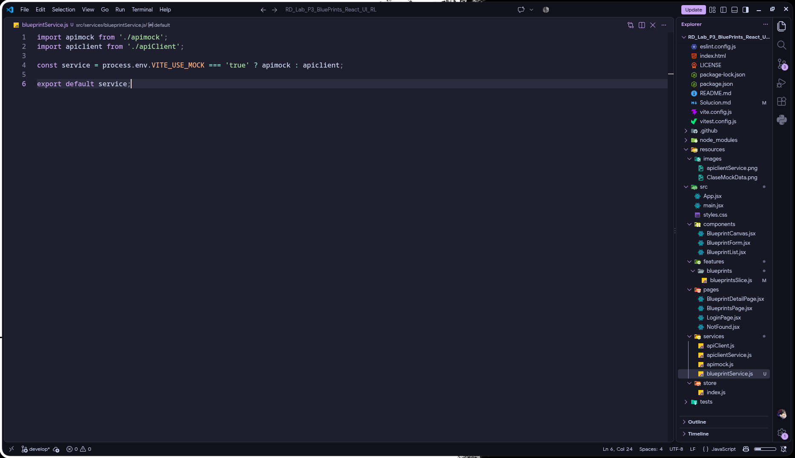

Ahora, en continuidad con la implementacion de este modulo, lo que se realizo fue la implementacion del import de la clase anteriormente creada, este import se realizo en el archivo `blueprintSlice.js` para poder hacer uso de los metodos de la interfaz y de esta manera poder hacer uso de los metodos segun la variable `VITE_USE_MOCK` en el archivo `.env`, de esta manera podemos alternar entre el mock y el cliente real sin necesidad de modificar el codigo, solo modificando la variable en el archivo `.env`.
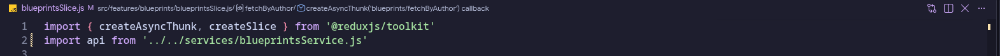

Al realizar esto, se pudo evidenciar que al momento de `VITE_USE_MOCK` cambie de estado, cuando este en `false` en `apliclientService.js` por la sintaxis que se maneja en axios y la solucion que teniamos implementada no funcionara de la mejor manera, entonces lo que haremos es modificar la forma en la que se soluciona el llamado a los diferentes endpoints y queda de la siguiente manera:
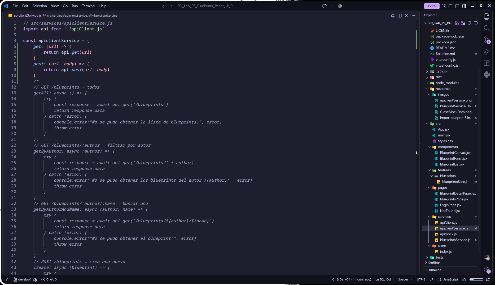


## CREACION DEL MODULO PARA EL ACCES TOKEN JWT: PrivateRoute

Antes de realizar cualquier cambio o agregar alguna clase, preferimos aprender y saber como funciona este encabezado, entonces como lo haremos; en `apiclient.js` ya se tiene el interceptor que agrega `Authorization: Bearer TOKEN` a cada request automatica; y en `LoginPage.jsx` ya guarda el token en `localStorage` con `localStorage.setItem('token', data.token)`. Teniendo esto en cuenta lo que falta en esta capa es un `<PrivateRoute>`, el cual proteja las rutas las cuales requieren de autenticacion.

Entonces la funcion que va a cumplir el `PrivateRoute` es la de un portero, se encargara de verificar si el usuario quiere acceder a una ruta protegida, `PrivateRoute` revisa si el usuario tiene un token en `localStorage`. Si lo tiene, le permite acceder a la ruta; si no lo tiene, lo redirige a la página de login. Esto asegura que solo los usuarios autenticados puedan acceder a ciertas partes de la aplicación.

Para el desarrollo de este punto lo que haremos es lo siguiente:

Primero se crea la clase `PrivateRoute.jsx` en la carpeta `src/components/`; de este modo controlaremos los enrutadores que se dirijen hacia el login o mostrando el contenido de la pagina principal, esto dependiendo de si el usuario tiene un token en `localStorage` o no.:
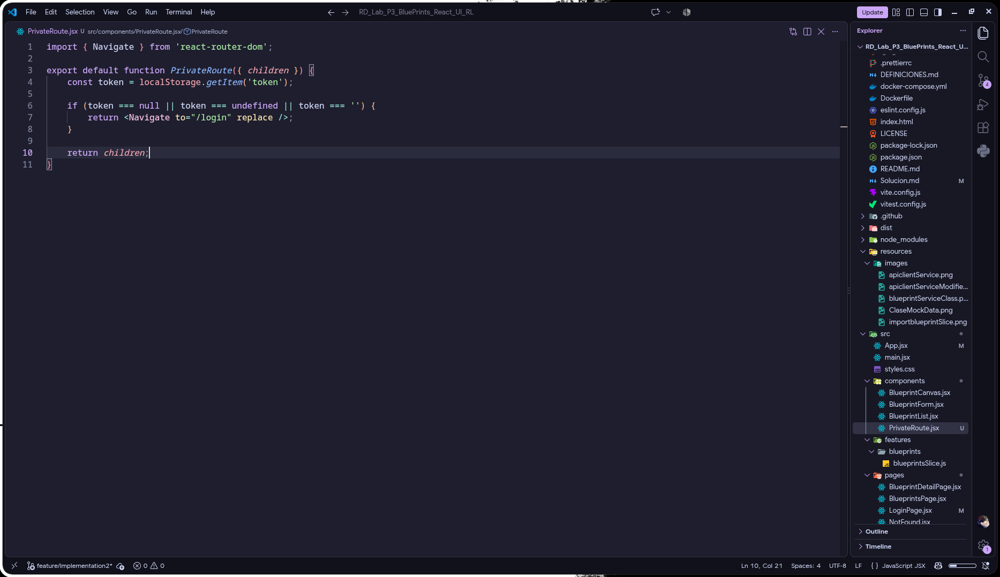

Luego modificaremos el enrutador en la clase `app.jsx`:
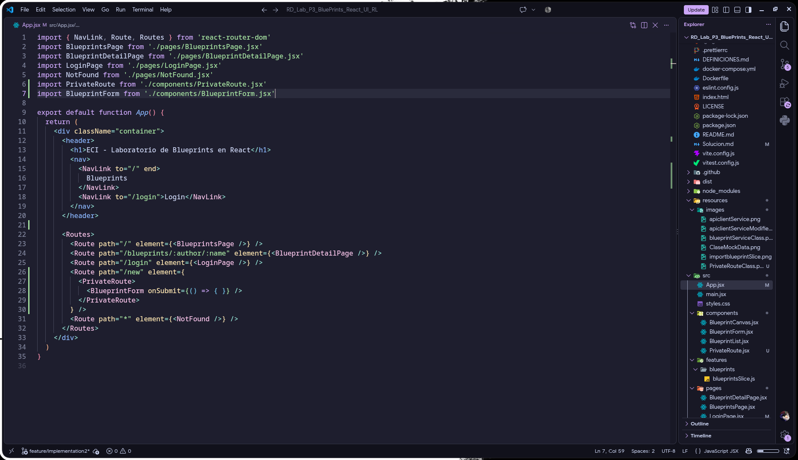

Y por ultimo realizamos un cambio en la clase `LoginPage.jsx` para que al momento de hacer login y tener un token en `localStorage`, se redirija a la pagina principal, esto se hace con el hook `useNavigate()` de React Router.:
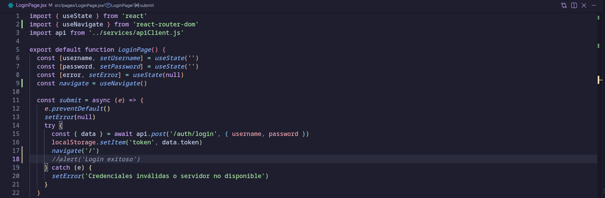


## CONEXION BLUEPRINT AL STORE REDUX

Entonces, para realizar la conexion con el redux debemos tener en cuenta que la ruta `/new` existe y ya esta protegida; entonces de este modocuando el usuario guarde un blueprint, se haga el dispatch real.

Entonces, lo que vamos a realizar como primer paso de la solucion es que el `BluePrintForm` llame a `onSubmit` con los siguientes datos: `{ author: 'john', name: 'casa', points: [{x:1,y:2}] }`

En la clase `App.jsx` vamos a agregar ciertos cambios, iniciando por los imports de `react-redux` y `./features/blueprints/blueprintsSlice.js`; junto a esto voy a modificar el componente dentro de `App.jsx` para que haga el dispatch de `createBlueprint` con los datos del formulario, de esta manera se va a poder hacer la conexion con el store de redux y se va a poder guardar el blueprint en el store.
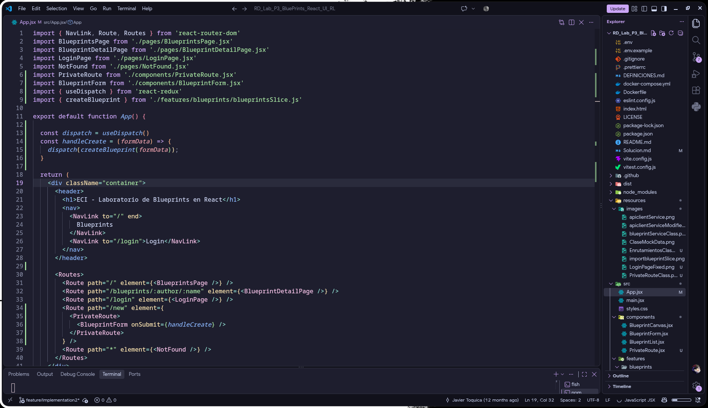

Despues de esto, si realizamos las siguientes 3 pruebas ejecutando el projecto deberiamos tener las siguientes pruebas exitosas:
1. Abrir http://localhost:5173/login, luego intentamos entrar sin credenciales, lo cual debería fallar (sin backend)
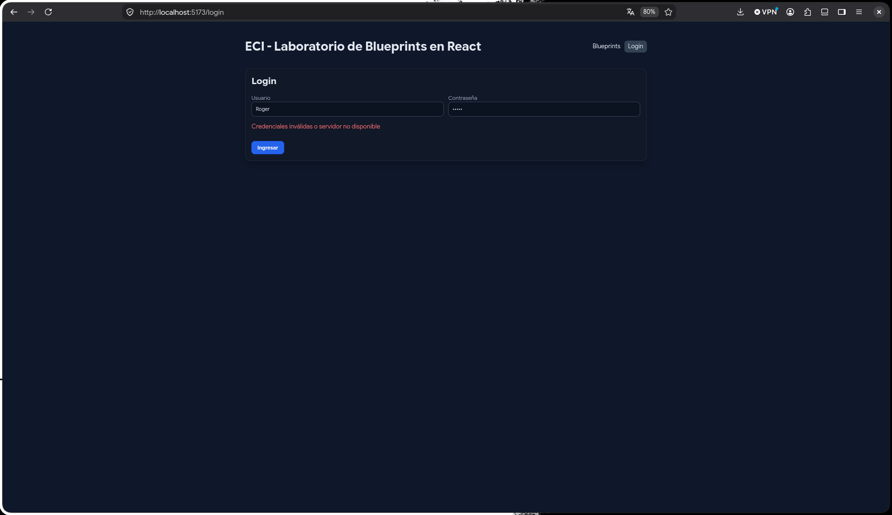

2. Abre http://localhost:5173/new sin estar logueado, lo cual debe redirigir a /login automáticamente
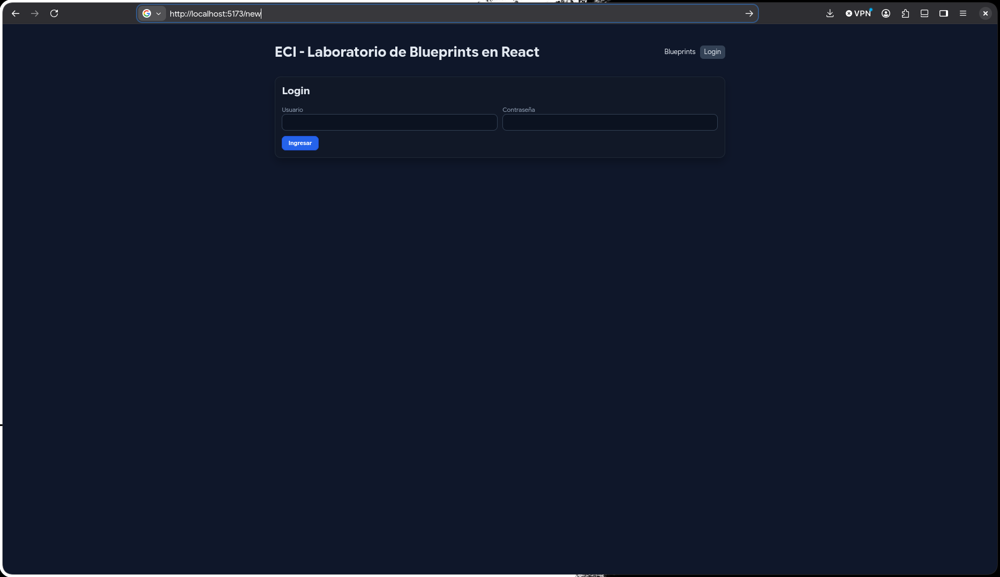

3. Con VITE_USE_MOCK=true, simulamos estar logueados poniendo en la consola del navegador: localStorage.setItem('token', 'fake-token'), luego recargamos `/new`, lo cual nos debe mostrar el formulario\
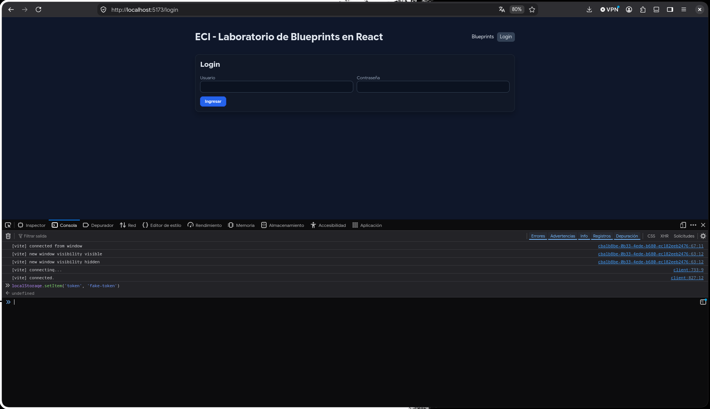
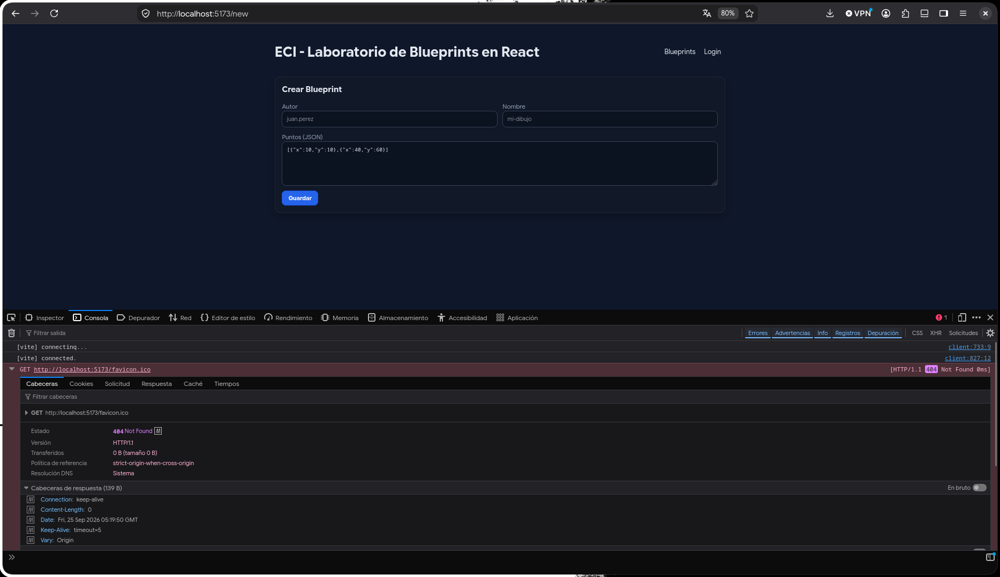

