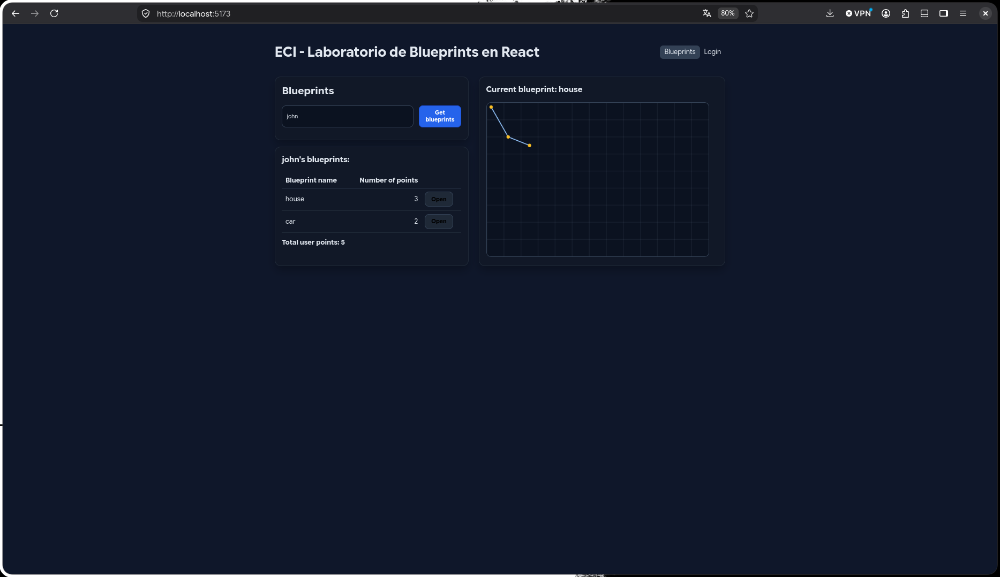
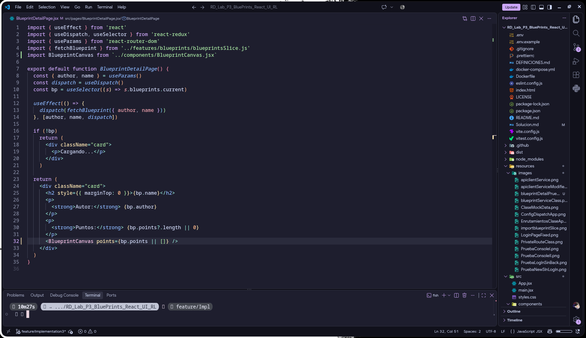
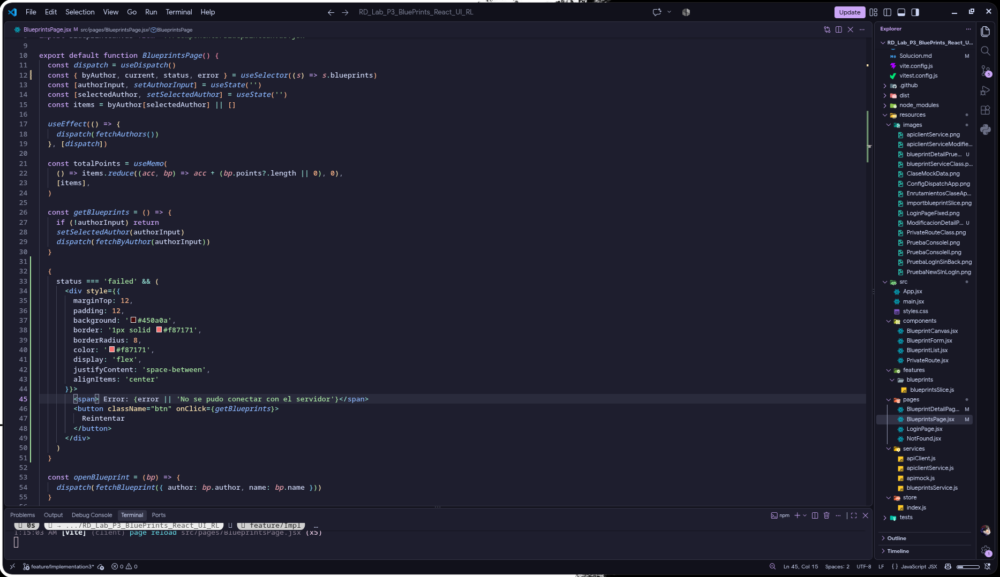
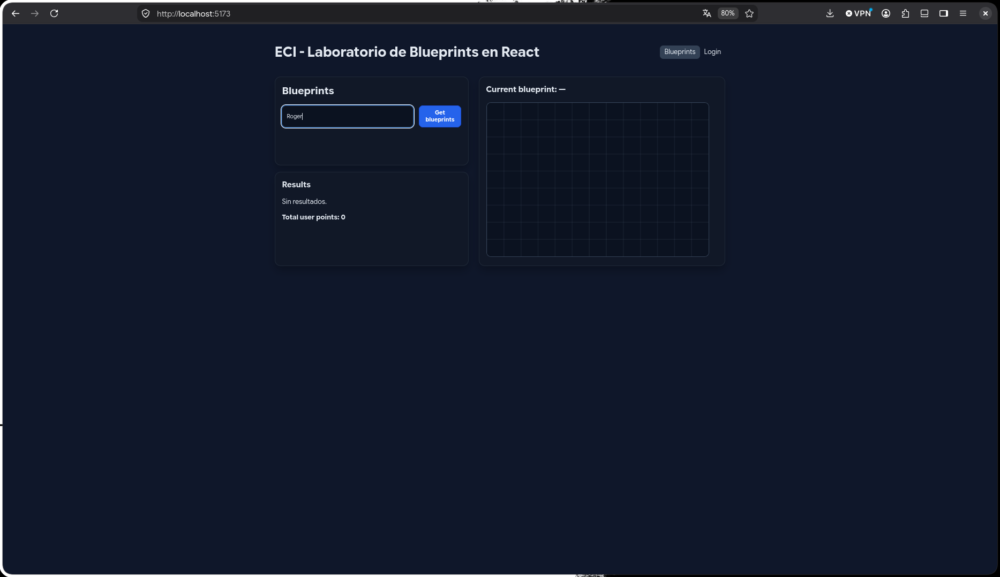
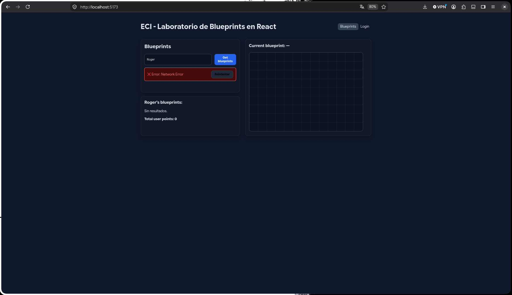
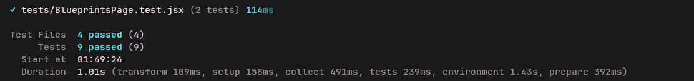
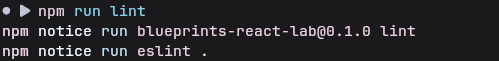
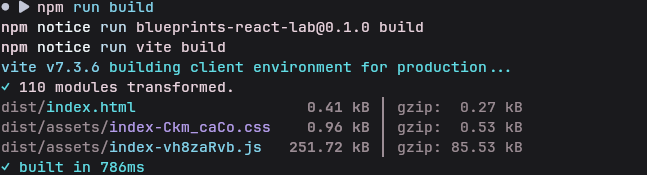
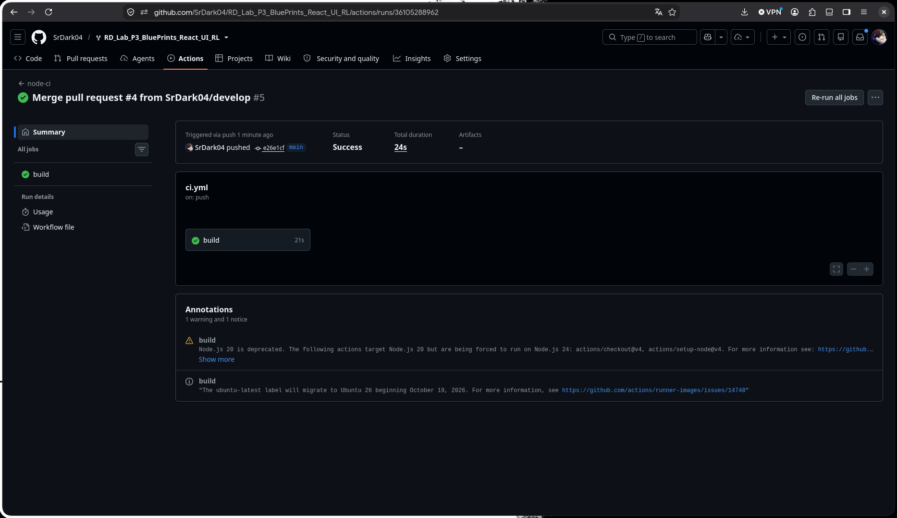

# SOLUCION DEL LABORATORIO 

## ESTUDIANTES:
1. Roger Mauricio Duran Guacaneme
2. Camilo Alfonso Leon Acosta

---

## CONTENIDO:
1. [Preparación del entorno y solución de errores base](#preparacion-del-entorno-y-solucion-de-errores-base)
2. [Implementación de apimock y apiclientservice](#implementacion-de-apimock-y-apiclientservice)
3. [Creación del módulo blueprintsService (Switch Mock/API)](#creacion-del-modulo-blueprintsservice-switch-mockapi)
4. [Seguridad y Control de Acceso: PrivateRoute y JWT](#seguridad-y-control-de-acceso-privateroute-y-jwt)
5. [Conexión de BlueprintForm al Store de Redux](#conexion-de-blueprintform-al-store-de-redux)
6. [Mejora de BlueprintDetailPage con BlueprintCanvas](#mejora-de-blueprintdetailpage-con-blueprintcanvas)
7. [Manejo de Estados, Errores y UX (Banner con Reintentar)](#manejo-de-estados-errores-y-ux-banner-con-reintentar)
8. [Creación y Ejecución de Pruebas Unitarias con Vitest](#creacion-y-ejecucion-de-pruebas-unitarias-con-vitest)
9. [Verificación de Calidad: Lint, Format y Build](#verificacion-de-calidad-lint-format-y-build)
10. [Integración Continua (CI con GitHub Actions)](#integracion-continua-ci-con-github-actions)
11. [Matriz de Cumplimiento de Requerimientos](#matriz-de-cumplimiento-de-requerimientos)
12. [Conclusiones](#conclusiones)

---

## PREPARACION DEL ENTORNO Y SOLUCION DE ERRORES BASE:

Realizamos la instalación de dependencias y configuración del proyecto con Vite, React, Redux Toolkit, Axios y Vitest. Se creó el archivo `.env` para definir la URL base del backend y se configuró el servicio de Blueprints para alternar entre el mock y el cliente real según la variable `VITE_USE_MOCK`.

Durante la preparación del entorno, se detectaron y corrigieron los siguientes aspectos críticos en el proyecto base para asegurar su funcionamiento:

1. **Aprobación de scripts de esbuild en NPM:**
   Al realizar la instalación inicial, el motor binario interno de Vite (`esbuild`) fue retenido por políticas de seguridad de scripts de npm (`allowScripts`). Se solucionó ejecutando `npm install-scripts approve esbuild`, permitiendo la generación de binarios en `node_modules/.bin/vite`.

2. **Configuración de variables globales en Vitest (`vitest.config.js`):**
   Al correr `npm test`, se presentó `ReferenceError: expect is not defined`. Esto ocurrió porque `@testing-library/jest-dom` en `tests/setup.js` invoca `expect.extend()` inmediatamente en su importación. Se resolvió agregando `globals: true` y definiendo el entorno de desarrollo de React mediante `define: { 'process.env.NODE_ENV': '"test"' }`:
   ```javascript
   export default defineConfig({
     plugins: [react()],
     define: {
       'process.env.NODE_ENV': '"test"',
     },
     test: {
       globals: true,
       environment: 'jsdom',
       setupFiles: './tests/setup.js',
     },
   })
   ```

3. **Protección contra valores nulos en el Canvas (`src/components/BlueprintCanvas.jsx`):**
   En entornos de prueba con `jsdom`, el navegador emulado no implementa el renderizado 2D de canvas nativo. Cuando `vi.spyOn(HTMLCanvasElement.prototype, 'getContext')` intercepta la llamada, `getContext('2d')` puede retornar `null`. Se agregó una validación temprana (`guard clause`) para evitar que la aplicación arroje `TypeError: Cannot read properties of null (reading 'clearRect')`:
   ```javascript
   // Antes
   const ctx = canvas.getContext('2d')
   ctx.clearRect(0, 0, canvas.width, canvas.height) 

   // Después
   const ctx = canvas.getContext('2d') 
   if (!ctx) return
   ctx.clearRect(0, 0, canvas.width, canvas.height)
   ```

4. **Accesibilidad y asociación de Labels en formularios (`src/components/BlueprintForm.jsx`):**
   Testing Library arrojaba error al buscar controles por etiqueta (`getByLabelText(/Autor/i)`). Para resolver esto y apegarse a las directrices de accesibilidad web (WCAG / a11y), se vincularon explícitamente los `<label>` mediante el atributo `htmlFor` con el `id` correspondiente en los elementos `<input>` y `<textarea>`:
   ```jsx
   // Antes
   <label>Autor</label>
   <input className="input" value={author}... />

   // Después
   <label htmlFor="bp-author">Autor</label>
   <input id="bp-author" className="input" value={author}... />
   ``` 
   Se aplicó el mismo patrón para "Nombre" (`bp-name`) y "Puntos (JSON)" (`bp-points`).

---

## IMPLEMENTACION DE APIMOCK Y APICLIENTSERVICE:

El requerimiento 4 del laboratorio exige implementar dos servicios intercambiables con la misma interfaz para desacoplar el frontend del backend:
- `apimock.js`: retorna datos de prueba en memoria.
- `apiclientService.js`: consume el API REST real mediante Axios.

Ambos servicios implementan los métodos necesarios para la consulta y persistencia de planos:
- `get(url)`: Realiza consultas HTTP o emula consultas filtrando datos.
- `post(url, data)`: Guarda un nuevo plano.

### `apimock.js`:


### `apiclientService.js`:


### Enfoque Open/Closed Principle (SOLID) en `apimock.js`:
Para garantizar que el mock no dependa de nombres de autores predefinidos en código duro y cumpla con el principio **Open/Closed (OCP)**, se implementó una función que descompone y analiza dinámicamente cualquier URL recibida:
```javascript
const parts = url.split('/').filter(part => part !== '');
```
De esta manera, el mock resuelve de forma genérica:
- `/blueprints` $\rightarrow$ Lista completa de planos.
- `/blueprints/{author}` $\rightarrow$ Filtrado de planos para cualquier autor (`John`, `Jane`, `Carlos`, etc.).
- `/blueprints/{author}/{name}` $\rightarrow$ Búsqueda exacta de un plano individual.
- `/blueprints` (POST) $\rightarrow$ Inserción en memoria de un nuevo plano.

---

## CREACION DEL MODULO BLUEPRINTS SERVICE (SWITCH MOCK/API):

Se creó el módulo centralizador `src/services/blueprintsService.js`. Su responsabilidad única es leer la variable de entorno `VITE_USE_MOCK` y exportar transparentemente la implementación que corresponda.

```javascript
// src/services/blueprintsService.js
import apimock from './apimock';
import apiclientService from './apiclientService';

const service = import.meta.env.VITE_USE_MOCK === 'true' ? apimock : apiclientService;

export default service;
```


Posteriormente, en `src/features/blueprints/blueprintsSlice.js`, se sustituyó la importación directa de Axios para consumir en su lugar `blueprintsService`:
```javascript
// src/features/blueprints/blueprintsSlice.js
import api from '../../services/blueprintsService.js'
```


Para garantizar compatibilidad total con la firma esperada por Redux Toolkit (`const { data } = await api.get(...)`), `apiclientService.js` delega directamente en la instancia de Axios configurada:


---

## SEGURIDAD Y CONTROL DE ACCESO: PRIVATEROUTE Y JWT:

La seguridad se estructuró en dos niveles fundamentales:
1. **Nivel de Transporte (Axios Interceptors):** En `src/services/apiClient.js`, cada solicitud saliente es interceptada para anexar el encabezado `Authorization: Bearer <token>` extraído de `localStorage`. Asimismo, si el backend responde con estado `401 Unauthorized`, se remueve automáticamente el token caducado.
2. **Nivel de Interfaz (Rutas Protegidas):** Se creó el componente `src/components/PrivateRoute.jsx`, que opera como un guardián de rutas. Si el usuario no cuenta con un token en `localStorage`, es redirigido a `/login`:

```jsx
// src/components/PrivateRoute.jsx
import { Navigate } from 'react-router-dom';

export default function PrivateRoute({ children }) {
    const token = localStorage.getItem('token');

    if (!token) {
        return <Navigate to="/login" replace />;
    }

    return children;
}
```


En `src/App.jsx`, se declaró la ruta de creación `/new` protegida por `<PrivateRoute>`:


En `src/pages/LoginPage.jsx`, tras almacenar el token de autenticación, se utiliza el hook `useNavigate()` de React Router para redirigir fluidamente al usuario a la vista principal:


---

## CONEXION DE BLUEPRINTFORM AL STORE DE REDUX:

Con la ruta `/new` debidamente protegida, se conectó el componente `BlueprintForm` con el ciclo de vida de Redux mediante el despachador de acciones (`useDispatch`) y el thunk `createBlueprint`:

```jsx
const dispatch = useDispatch()
const handleCreate = (formData) => {
  dispatch(createBlueprint(formData));
}
```


### Evidencias de Validación del Flujo de Seguridad:
1. **Acceso al login e intento de ingreso sin backend:**
   

2. **Intento de acceso directo a `/new` sin autenticación (Redirección automática a `/login`):**
   

3. **Ingreso autorizado con Token JWT en `localStorage` (Renderizado del formulario de creación):**
   
   

---

## MEJORA DE `BlueprintDetailPage` CON `<BlueprintCanvas>`:

Originalmente, `BlueprintDetailPage.jsx` renderizaba los planos utilizando un elemento `<svg>` estático que únicamente marcaba puntos dispersos mediante círculos:


Para cumplir con la coherencia arquitectónica y reutilización de componentes, se actualizó la vista reemplazando el SVG por el componente interactivo `<BlueprintCanvas>`, permitiendo visualizar la cuadrícula arquitectónica, los trazos conectores continuos y los puntos resaltados:

```jsx
// Reemplazo en BlueprintDetailPage.jsx
<BlueprintCanvas points={bp.points || []} />
```


---

## MANEJO DE ESTADOS, ERRORES Y UX (BANNER CON REINTENTAR):

Para satisfacer el criterio de evaluación de **Manejo de estado, errores y experiencia de usuario (UX)**, se implementó un banner interactivo de retroalimentación en `src/pages/BlueprintsPage.jsx`.

El componente monitorea el estado `status === 'failed'` y la existencia de una consulta previa (`selectedAuthor`), desplegando un banner de alerta con la descripción del error y un botón de acción rápida que re-despacha la petición sin obligar al usuario a recargar la página:



### Validación del Banner de Error:
Se configuró `VITE_USE_MOCK=false` en el archivo `.env` para simular la indisponibilidad del servidor backend. Al realizar la búsqueda de un autor, la interfaz captura el fallo en el thunk de Redux y despliega la advertencia:



---

## CREACION Y EJECUCION DE PRUEBAS UNITARIAS CON VITEST:

Se diseñó una suite de pruebas automatizadas con **Vitest + Testing Library + jsdom** orientada a validar la lógica de negocio pura, la integración de componentes y el manejo del estado global.

### 1. Pruebas de Reducers Puros (`tests/blueprintsSlice.test.jsx`)
Valida el comportamiento inmutable y predecible del reducer de Redux frente a las acciones de los thunks asíncronos:
- **Inicialización:** Verifica el estado inicial (`authors: []`, `status: 'idle'`, etc.).
- **`fetchAuthors.pending`:** Comprueba la transición del estado a `'loading'`.
- **`fetchAuthors.rejected`:** Comprueba la captura de errores en `state.error` y cambio a `'failed'`.
- **`fetchByAuthor.fulfilled`:** Valida que la colección de planos se almacene correctamente indexada bajo la clave del autor correspondiente.
- **`fetchBlueprint.fulfilled`:** Valida que el plano consultado se asigne como plano actual (`state.current`).

```javascript
describe('blueprints slice', () => {
  it('should initialize correctly', () => {
    const state = reducer(undefined, { type: '@@INIT' })
    expect(state.authors).toEqual([])
  })

  it('fetchAuthors.pending → status loading', () => {
    const action = fetchAuthors.pending('', undefined)
    const state = reducer(initialState, action)
    expect(state.status).toBe('loading')
  })

  it('fetchAuthors.rejected → status failed con mensaje', () => {
    const action = fetchAuthors.rejected(new Error('Network Error'), '', undefined)
    const state = reducer(initialState, action)
    expect(state.status).toBe('failed')
    expect(state.error).toBe('Network Error')
  })

  it('fetchByAuthor.fulfilled → guarda items por autor', () => {
    const blueprints = [
      { author: 'John', name: 'house', points: [] },
      { author: 'John', name: 'car', points: [] },
    ]
    const action = fetchByAuthor.fulfilled({ author: 'John', items: blueprints }, '', 'John')
    const state = reducer(initialState, action)
    expect(state.byAuthor['John']).toHaveLength(2)
  })

  it('fetchBlueprint.fulfilled → actualiza current', () => {
    const bp = { author: 'John', name: 'house', points: [{ x: 1, y: 2 }] }
    const action = fetchBlueprint.fulfilled(bp, '', { author: 'John', name: 'house' })
    const state = reducer(initialState, action)
    expect(state.current).toEqual(bp)
  })
})
```

### 2. Pruebas de Integración y Componentes UI:
- **`tests/BlueprintsPage.test.jsx`:** Valida que la interacción del usuario al ingresar un autor y hacer clic en *"Get blueprints"* despache efectivamente la acción `fetchByAuthor` con el payload exacto, y comprueba el renderizado del mensaje *"Sin resultados."* cuando el autor no tiene registros.
- **`tests/BlueprintCanvas.test.jsx`:** Verifica que el componente monte correctamente el elemento `<canvas>` en el DOM y solicite su contexto de renderizado 2D.
- **`tests/BlueprintForm.test.jsx`:** Simula el ingreso de autor, nombre y estructura de puntos en JSON, comprobando que al someter el formulario los datos viajen estructurados y serializados correctamente a la función `onSubmit`.

### Ejecución de Pruebas:
Al ejecutar `npm test`, se comprueba el paso exitoso de **todos los casos de prueba (9/9 pruebas en 4 suites)**:

```text
 ✓ tests/blueprintsSlice.test.jsx (5 tests)
 ✓ tests/BlueprintCanvas.test.jsx (1 test)
 ✓ tests/BlueprintForm.test.jsx (1 test)
 ✓ tests/BlueprintsPage.test.jsx (2 tests)

 Test Files  4 passed (4)
      Tests  9 passed (9)
```

> **Evidencia – Ejecución de Pruebas Unitarias:**  
> 

---

## VERIFICACION DE CALIDAD: LINT, FORMAT Y BUILD:

Siguiendo las mejores prácticas de la industria y la rúbrica de evaluación, se realizaron las validaciones estáticas de código:

1. **Linter con ESLint 9 (Flat Config):**
   ```bash
   npm run lint
   ```
   *Resultado:* Código limpio, sin variables huérfanas, sin imports circulares ni inconsistencias de sintaxis.
   > **Evidencia – ESLint:**  
   > 

2. **Formateo con Prettier:**
   ```bash
   npm run format
   ```
   *Resultado:* Estilo homogéneo en todo el árbol de archivos `.js`, `.jsx`, `.css` y `.json`.

3. **Compilación para Producción (Vite Build):**
   ```bash
   npm run build
   ```
   *Resultado:* Generación limpia de bundles empaquetados y minificados en `dist/` sin errores de compilación ni dependencias rotas.
   > **Evidencia – Build de Producción:**  
   > 

---

## INTEGRACION CONTINUA (CI CON GITHUB ACTIONS):

El repositorio cuenta con el flujo automatizado `.github/workflows/ci.yml`. Cada evento de `push` o `pull_request` sobre el repositorio dispara el ciclo completo de integración continua en contenedores Ubuntu con Node.js 20:

```yaml
name: node-ci
on:
  push:
  pull_request:
jobs:
  build:
    runs-on: ubuntu-latest
    steps:
      - uses: actions/checkout@v4
      - uses: actions/setup-node@v4
        with:
          node-version: 20
          cache: 'npm'
      - run: npm ci || npm install
      - run: npm run lint
      - run: npm test
      - run: npm run build
```

> **Evidencia – Pipeline de CI en GitHub Actions:**  
> 

---

## MATRIZ DE CUMPLIMIENTO DE REQUERIMIENTOS:

| Requerimiento / Criterio | Peso | Archivos Clave | Estado |
|---|:---:|---|:---:|
| **1. Canvas (Lienzo):** Renderizado de cuadrícula, trazo continuo y puntos con dimensiones adecuadas (520×360). | Req. 1 | `src/components/BlueprintCanvas.jsx` | ✅ Cumplido |
| **2. Consulta y Listado de Planos:** Búsqueda por autor, tabla reactiva de nombres y conteo de puntos. | Req. 2 | `src/pages/BlueprintsPage.jsx` | ✅ Cumplido |
| **3. Graficación interactiva de Plano:** Selección mediante botón `Open`, actualización del plano actual y dibujo. | Req. 3 | `src/pages/BlueprintsPage.jsx`, `src/pages/BlueprintDetailPage.jsx` | ✅ Cumplido |
| **4. Doble Servicio (`apimock` / `apiClient`):** Conmutación mediante variable de entorno `VITE_USE_MOCK` en una línea. | Req. 4 | `src/services/apimock.js`, `src/services/apiclientService.js`, `src/services/blueprintsService.js` | ✅ Cumplido |
| **5. Estado Global con Redux:** Gestión centralizada con Redux Toolkit (slices, thunks, reducers puros). | Req. 5 | `src/features/blueprints/blueprintsSlice.js`, `src/store/index.js` | ✅ Cumplido |
| **6. Estilos y Presentación:** Diseño organizado en cuadrículas, tablas legibles y tarjetas de contenido. | Req. 6 | `src/styles.css` | ✅ Cumplido |
| **7. Pruebas Automatizadas (Vitest + Testing Library):** Pruebas unitarias de reducers y componentes. | Req. 7 | `tests/blueprintsSlice.test.jsx`, `tests/BlueprintsPage.test.jsx`, `tests/BlueprintCanvas.test.jsx`, `tests/BlueprintForm.test.jsx` | ✅ Cumplido |
| **8. Seguridad (JWT + Rutas Protegidas):** Interceptores Axios para bearer token y componente `PrivateRoute`. | Criterio Seg. | `src/services/apiClient.js`, `src/components/PrivateRoute.jsx`, `src/pages/LoginPage.jsx` | ✅ Cumplido |
| **9. Calidad, Linter y CI/CD:** ESLint 9, Prettier, compilación Vite y workflow de GitHub Actions. | Criterio CI | `eslint.config.js`, `.github/workflows/ci.yml`, `vite.config.js` | ✅ Cumplido |

---

## CONCLUSIONES:

1. **Desacoplamiento mediante el Principio Open/Closed:** La arquitectura de servicios implementada permite cambiar la fuente de datos entre un entorno mock en memoria y una API REST real simplemente modificando una variable de entorno (`VITE_USE_MOCK`), sin alterar ni una sola línea de lógica en los componentes ni en los reducers.
2. **Predictibilidad con Redux Toolkit:** Centralizar el estado de los planos y el ciclo de vida de las peticiones (`idle`, `loading`, `succeeded`, `failed`) evita la dispersión del estado y garantiza una experiencia de usuario consistente, habilitando mecanismos de resiliencia como el botón de reintento.
3. **Seguridad Integral en Frontend:** La combinación de interceptores en Axios para inyección automática de tokens JWT junto con componentes de enrutamiento protegido (`PrivateRoute`) garantiza que las operaciones sensibles queden resguardadas de accesos no autorizados.
4. **Verificación Automatizada y Resiliencia:** El diseño de pruebas unitarias sobre funciones puras (reducers) e integración de componentes (Testing Library) provee un arnés de seguridad confiable para futuras iteraciones y asegura el éxito del despliegue en entornos de Integración Continua (CI/CD).